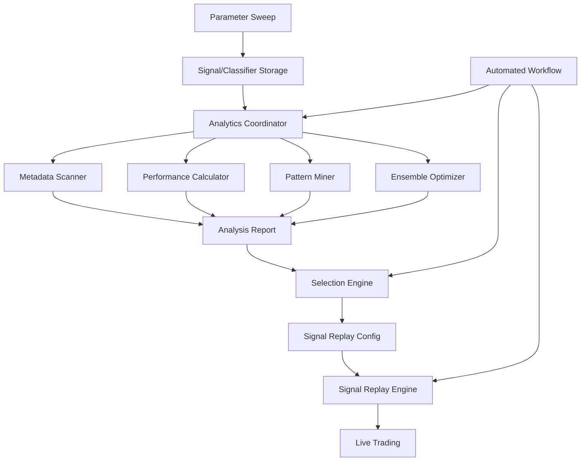

# Comprehensive Analytics Module Architecture

## Overview

The analytics module provides a complete solution for analyzing trading system performance, identifying optimal strategy-classifier combinations, and automating regime-aware ensemble selection. It integrates with the existing workspace storage to provide fast metadata scanning, retroactive metric calculation, and signal replay orchestration.

## Architecture Components

### 1. File Structure & Metadata System

#### Enhanced Workspace File Structure
```
workspaces/
├── {run_id}/
│   ├── metadata.json                    # Run-level metadata with summary
│   ├── summary/
│   │   ├── performance_summary.json     # Quick-scan performance metrics
│   │   ├── regime_summary.json          # Regime transition summary
│   │   └── strategy_rankings.json       # Pre-computed rankings
│   ├── signals/
│   │   ├── {strategy_id}/
│   │   │   ├── metadata.json           # Strategy metadata & parameters
│   │   │   ├── signals.parquet         # Sparse signal storage
│   │   │   └── performance.json        # Cached performance metrics
│   │   └── combined/
│   │       └── ensemble_signals.parquet # Combined weighted signals
│   ├── classifiers/
│   │   ├── {classifier_id}/
│   │   │   ├── metadata.json           # Classifier configuration
│   │   │   ├── states.parquet          # Sparse regime storage
│   │   │   └── transitions.json        # Regime transition summary
│   │   └── combined/
│   │       └── consensus_regimes.parquet
│   ├── events/
│   │   ├── traces.parquet              # Full event lineage
│   │   └── index.json                  # Event index for fast lookup
│   └── analytics/
│       ├── correlation_matrix.json     # Strategy correlations
│       ├── regime_performance.json     # Performance by regime
│       └── optimal_weights.json        # Calculated ensemble weights
```

#### Metadata Header Schema
```python
# File: src/analytics/storage/schemas.py

from typing import Dict, List, Optional, Any
from dataclasses import dataclass
from datetime import datetime
from decimal import Decimal

@dataclass
class RunMetadata:
    """Top-level run metadata for fast scanning"""
    run_id: str
    created_at: datetime
    workflow_type: str  # optimization, backtest, live
    
    # Quick scan summary
    total_strategies: int
    total_classifiers: int
    total_events: int
    
    # Performance summary
    best_sharpe: Decimal
    best_strategy: str
    best_classifier: str
    
    # Execution costs
    commission_model: str
    slippage_model: str
    
    # Data range
    start_date: datetime
    end_date: datetime
    symbols: List[str]
    
    # File locations
    signal_files: Dict[str, str]
    classifier_files: Dict[str, str]
    event_trace_file: str

@dataclass
class SignalMetadata:
    """Strategy signal metadata"""
    strategy_id: str
    strategy_type: str
    parameters: Dict[str, Any]
    
    # Summary stats
    total_signals: int
    signal_changes: int  # For sparse storage
    compression_ratio: float
    
    # Quick performance metrics
    sharpe_ratio: Decimal
    total_return: Decimal
    max_drawdown: Decimal
    win_rate: Decimal
    
    # Execution costs impact
    gross_sharpe: Decimal
    net_sharpe: Decimal
    cost_impact: Decimal
    
    # Regime performance
    regime_performance: Dict[str, Dict[str, Decimal]]

@dataclass
class ClassifierMetadata:
    """Classifier state metadata"""
    classifier_id: str
    classifier_type: str
    parameters: Dict[str, Any]
    
    # Summary stats
    total_states: int
    state_changes: int
    compression_ratio: float
    
    # Regime statistics
    regime_counts: Dict[str, int]
    avg_regime_duration: Dict[str, float]
    transition_matrix: Dict[str, Dict[str, float]]
```

### 2. Core Analytics Components

#### Performance Calculator
```python
# File: src/analytics/calculators/performance.py

from typing import Protocol, Dict, List, Optional
from decimal import Decimal
import pandas as pd
import numpy as np

class PerformanceCalculator(Protocol):
    """Calculate performance metrics with execution costs"""
    
    def calculate_metrics(
        self,
        returns: pd.Series,
        signals: pd.Series,
        execution_costs: Optional[ExecutionCosts] = None
    ) -> PerformanceMetrics:
        """Calculate comprehensive performance metrics"""
        ...

class ExecutionCosts:
    """Model execution costs"""
    def __init__(
        self,
        commission_rate: Decimal = Decimal("0.001"),  # 10 bps
        slippage_model: str = "linear",
        slippage_bps: Decimal = Decimal("0.0005")  # 5 bps
    ):
        self.commission_rate = commission_rate
        self.slippage_model = slippage_model
        self.slippage_bps = slippage_bps
    
    def calculate_cost(self, trade_value: Decimal, volatility: Decimal) -> Decimal:
        """Calculate total execution cost"""
        commission = trade_value * self.commission_rate
        
        if self.slippage_model == "linear":
            slippage = trade_value * self.slippage_bps
        elif self.slippage_model == "sqrt":
            # Square-root market impact
            slippage = trade_value * self.slippage_bps * np.sqrt(volatility)
        
        return commission + slippage

class PerformanceMetrics:
    """Comprehensive performance metrics"""
    def __init__(self):
        self.total_return: Decimal
        self.annualized_return: Decimal
        self.volatility: Decimal
        self.sharpe_ratio: Decimal
        self.sortino_ratio: Decimal
        self.max_drawdown: Decimal
        self.calmar_ratio: Decimal
        self.win_rate: Decimal
        self.profit_factor: Decimal
        self.avg_win: Decimal
        self.avg_loss: Decimal
        self.largest_win: Decimal
        self.largest_loss: Decimal
        
        # With execution costs
        self.gross_return: Decimal
        self.net_return: Decimal
        self.total_costs: Decimal
        self.cost_per_trade: Decimal
        self.net_sharpe: Decimal

class RegimeAwareCalculator:
    """Calculate metrics by regime"""
    
    def calculate_regime_metrics(
        self,
        returns: pd.Series,
        signals: pd.Series,
        regimes: pd.Series,
        execution_costs: Optional[ExecutionCosts] = None
    ) -> Dict[str, PerformanceMetrics]:
        """Calculate performance metrics for each regime"""
        metrics = {}
        
        for regime in regimes.unique():
            regime_mask = regimes == regime
            regime_returns = returns[regime_mask]
            regime_signals = signals[regime_mask]
            
            calculator = StandardPerformanceCalculator()
            metrics[regime] = calculator.calculate_metrics(
                regime_returns,
                regime_signals,
                execution_costs
            )
        
        return metrics
```

#### Pattern Discovery
```python
# File: src/analytics/discovery/pattern_miner.py

from typing import List, Dict, Set, Tuple
import pandas as pd
from dataclasses import dataclass

@dataclass
class TradingPattern:
    """Discovered trading pattern"""
    pattern_id: str
    pattern_type: str  # momentum, mean_reversion, breakout
    
    # Pattern characteristics
    avg_duration: float
    win_rate: float
    avg_return: Decimal
    frequency: float
    
    # Regime association
    dominant_regimes: List[str]
    regime_win_rates: Dict[str, float]
    
    # Strategy association
    best_strategies: List[Tuple[str, float]]  # (strategy_id, correlation)
    
    # Market conditions
    volatility_range: Tuple[float, float]
    volume_profile: str

class PatternMiner:
    """Mine patterns from signal and event data"""
    
    def __init__(self, min_support: float = 0.05, min_confidence: float = 0.6):
        self.min_support = min_support
        self.min_confidence = min_confidence
    
    def mine_patterns(
        self,
        signals: pd.DataFrame,
        returns: pd.Series,
        regimes: pd.Series,
        events: pd.DataFrame
    ) -> List[TradingPattern]:
        """Discover recurring profitable patterns"""
        patterns = []
        
        # 1. Sequence mining on signals
        sequences = self._extract_signal_sequences(signals)
        frequent_sequences = self._find_frequent_sequences(sequences)
        
        # 2. Associate with returns
        for seq in frequent_sequences:
            seq_returns = self._calculate_sequence_returns(seq, returns)
            if seq_returns.mean() > 0:
                pattern = self._create_pattern(seq, seq_returns, regimes)
                patterns.append(pattern)
        
        # 3. Cross-reference with event traces
        patterns = self._enrich_with_events(patterns, events)
        
        return patterns
    
    def find_regime_patterns(
        self,
        regimes: pd.Series,
        returns: pd.Series
    ) -> Dict[str, List[str]]:
        """Find patterns in regime transitions"""
        transitions = self._extract_transitions(regimes)
        
        profitable_transitions = {}
        for transition in transitions:
            transition_returns = self._calculate_transition_returns(
                transition, regimes, returns
            )
            if transition_returns.mean() > 0:
                profitable_transitions[str(transition)] = transition_returns
        
        return profitable_transitions
```

#### Ensemble Optimizer
```python
# File: src/analytics/optimization/ensemble.py

from typing import Dict, List, Optional, Tuple
import numpy as np
from scipy.optimize import minimize
import pandas as pd

class EnsembleOptimizer:
    """Optimize strategy weights for regime-aware ensembles"""
    
    def __init__(
        self,
        objective: str = "sharpe",
        constraints: Optional[Dict] = None,
        regime_aware: bool = True
    ):
        self.objective = objective
        self.constraints = constraints or {
            "min_weight": 0.0,
            "max_weight": 0.5,
            "max_strategies": 5
        }
        self.regime_aware = regime_aware
    
    def optimize_weights(
        self,
        strategy_returns: pd.DataFrame,
        regimes: Optional[pd.Series] = None
    ) -> Dict[str, float]:
        """Find optimal strategy weights"""
        
        if self.regime_aware and regimes is not None:
            # Optimize weights per regime
            regime_weights = {}
            for regime in regimes.unique():
                regime_mask = regimes == regime
                regime_returns = strategy_returns[regime_mask]
                regime_weights[regime] = self._optimize_single(regime_returns)
            
            return regime_weights
        else:
            # Global optimization
            return self._optimize_single(strategy_returns)
    
    def _optimize_single(self, returns: pd.DataFrame) -> Dict[str, float]:
        """Optimize weights for a single regime or globally"""
        n_strategies = len(returns.columns)
        
        # Initial weights (equal weight)
        x0 = np.ones(n_strategies) / n_strategies
        
        # Constraints
        constraints = [
            {"type": "eq", "fun": lambda x: np.sum(x) - 1.0},  # Sum to 1
            {"type": "ineq", "fun": lambda x: x - self.constraints["min_weight"]},
            {"type": "ineq", "fun": lambda x: self.constraints["max_weight"] - x}
        ]
        
        # Optimize
        if self.objective == "sharpe":
            result = minimize(
                lambda w: -self._sharpe_ratio(returns, w),
                x0,
                method="SLSQP",
                constraints=constraints
            )
        elif self.objective == "min_variance":
            result = minimize(
                lambda w: self._portfolio_variance(returns, w),
                x0,
                method="SLSQP",
                constraints=constraints
            )
        
        # Apply sparsity constraint
        weights = result.x
        if self.constraints.get("max_strategies"):
            weights = self._apply_sparsity(weights, self.constraints["max_strategies"])
        
        return dict(zip(returns.columns, weights))
    
    def _sharpe_ratio(self, returns: pd.DataFrame, weights: np.ndarray) -> float:
        """Calculate portfolio Sharpe ratio"""
        portfolio_returns = returns @ weights
        return portfolio_returns.mean() / portfolio_returns.std() * np.sqrt(252)
```

### 3. Workflow Orchestration

#### Analytics Coordinator
```python
# File: src/analytics/coordinator/analytics_coordinator.py

from typing import Dict, List, Optional, Any
import asyncio
from pathlib import Path

class AnalyticsCoordinator:
    """Orchestrate analytics workflows"""
    
    def __init__(
        self,
        workspace_path: Path,
        event_bus: Optional[EventBus] = None
    ):
        self.workspace_path = workspace_path
        self.event_bus = event_bus
        self.metadata_cache = {}
    
    async def analyze_optimization_run(
        self,
        run_id: str,
        execution_costs: Optional[ExecutionCosts] = None
    ) -> AnalysisReport:
        """Analyze complete optimization run"""
        
        # 1. Fast metadata scan
        metadata = await self._scan_metadata(run_id)
        
        # 2. Calculate performance metrics
        performance_tasks = []
        for strategy_id in metadata.strategy_ids:
            task = self._calculate_strategy_performance(
                run_id, strategy_id, execution_costs
            )
            performance_tasks.append(task)
        
        performances = await asyncio.gather(*performance_tasks)
        
        # 3. Analyze regime performance
        regime_analysis = await self._analyze_regime_performance(
            run_id, performances
        )
        
        # 4. Discover patterns
        patterns = await self._mine_patterns(run_id)
        
        # 5. Optimize ensemble weights
        ensemble_weights = await self._optimize_ensemble(
            performances, regime_analysis
        )
        
        # 6. Generate report
        return AnalysisReport(
            run_id=run_id,
            strategy_performances=performances,
            regime_analysis=regime_analysis,
            discovered_patterns=patterns,
            ensemble_weights=ensemble_weights,
            recommendations=self._generate_recommendations(
                performances, regime_analysis, patterns
            )
        )
    
    async def prepare_signal_replay(
        self,
        analysis_report: AnalysisReport,
        target_regimes: Optional[List[str]] = None
    ) -> SignalReplayConfig:
        """Prepare configuration for signal replay"""
        
        # Select strategies based on analysis
        selected_strategies = self._select_strategies(
            analysis_report,
            max_strategies=5
        )
        
        # Get regime-specific weights
        if target_regimes:
            weights = {
                regime: analysis_report.ensemble_weights.get(regime, {})
                for regime in target_regimes
            }
        else:
            weights = analysis_report.ensemble_weights
        
        # Load signal data
        signal_data = await self._load_signals(
            analysis_report.run_id,
            selected_strategies
        )
        
        return SignalReplayConfig(
            strategies=selected_strategies,
            weights=weights,
            signal_data=signal_data,
            execution_params=self._optimize_execution_params(
                analysis_report
            )
        )
```

#### Automated Workflow Engine
```python
# File: src/analytics/workflows/automation.py

class AutomatedAnalyticsWorkflow:
    """Automate the complete analytics pipeline"""
    
    def __init__(
        self,
        selection_criteria: SelectionCriteria,
        analytics_coordinator: AnalyticsCoordinator,
        signal_replay_engine: SignalReplayEngine
    ):
        self.selection_criteria = selection_criteria
        self.analytics_coordinator = analytics_coordinator
        self.signal_replay_engine = signal_replay_engine
    
    async def run_automated_analysis(
        self,
        workspace_path: Path,
        output_path: Path
    ) -> WorkflowReport:
        """Run complete automated workflow"""
        
        # 1. Scan all optimization runs
        runs = await self._scan_workspace(workspace_path)
        
        # 2. Filter based on criteria
        qualified_runs = self._filter_runs(runs, self.selection_criteria)
        
        # 3. Analyze each qualified run
        analysis_reports = []
        for run in qualified_runs:
            report = await self.analytics_coordinator.analyze_optimization_run(
                run.run_id
            )
            analysis_reports.append(report)
        
        # 4. Rank and select best combinations
        ranked_combos = self._rank_combinations(analysis_reports)
        selected_combos = ranked_combos[:self.selection_criteria.max_selections]
        
        # 5. Prepare signal replay configurations
        replay_configs = []
        for combo in selected_combos:
            config = await self.analytics_coordinator.prepare_signal_replay(
                combo.analysis_report,
                target_regimes=self.selection_criteria.target_regimes
            )
            replay_configs.append(config)
        
        # 6. Execute signal replays (optional)
        if self.selection_criteria.auto_execute_replay:
            replay_results = await self._execute_replays(replay_configs)
        else:
            replay_results = None
        
        # 7. Generate comprehensive report
        return WorkflowReport(
            scanned_runs=len(runs),
            qualified_runs=len(qualified_runs),
            selected_combinations=selected_combos,
            replay_configurations=replay_configs,
            replay_results=replay_results,
            recommendations=self._generate_workflow_recommendations(
                analysis_reports, selected_combos
            )
        )

@dataclass
class SelectionCriteria:
    """Criteria for automated selection"""
    min_sharpe: Decimal = Decimal("1.0")
    min_win_rate: Decimal = Decimal("0.55")
    max_drawdown: Decimal = Decimal("0.20")
    min_trades: int = 100
    
    # Regime-specific criteria
    required_regimes: List[str] = None
    min_regime_performance: Dict[str, Decimal] = None
    
    # Ensemble criteria
    max_correlation: float = 0.7
    max_selections: int = 3
    
    # Execution
    auto_execute_replay: bool = False
    target_regimes: Optional[List[str]] = None
```

### 4. Data Flow Architecture



### 5. Visualization Components

#### Performance Dashboard
```python
# File: src/analytics/visualization/dashboard.py

from typing import Dict, List
import plotly.graph_objects as go
import plotly.express as px
from plotly.subplots import make_subplots

class PerformanceDashboard:
    """Interactive performance visualization"""
    
    def create_strategy_comparison(
        self,
        performances: Dict[str, PerformanceMetrics]
    ) -> go.Figure:
        """Create strategy comparison chart"""
        fig = make_subplots(
            rows=2, cols=2,
            subplot_titles=[
                "Sharpe Ratios", "Returns Distribution",
                "Drawdown Comparison", "Win Rate vs Profit Factor"
            ]
        )
        
        # Add traces for each metric
        # ... implementation ...
        
        return fig
    
    def create_regime_heatmap(
        self,
        regime_performances: Dict[str, Dict[str, PerformanceMetrics]]
    ) -> go.Figure:
        """Create regime performance heatmap"""
        # ... implementation ...
        
    def create_correlation_matrix(
        self,
        strategy_returns: pd.DataFrame
    ) -> go.Figure:
        """Create strategy correlation matrix"""
        # ... implementation ...
```

### 6. Storage Backend

#### Parquet Storage Manager
```python
# File: src/analytics/storage/parquet_manager.py

import pyarrow as pa
import pyarrow.parquet as pq
from typing import Dict, List, Optional
import pandas as pd

class ParquetStorageManager:
    """Efficient Parquet-based storage"""
    
    def __init__(self, workspace_path: Path):
        self.workspace_path = workspace_path
        self.metadata_cache = {}
    
    def write_signals(
        self,
        signals: pd.DataFrame,
        metadata: SignalMetadata,
        run_id: str,
        strategy_id: str
    ):
        """Write signals with metadata"""
        # Convert to sparse format
        sparse_signals = self._to_sparse_format(signals)
        
        # Add metadata to schema
        schema = pa.schema([
            ("timestamp", pa.timestamp("ns")),
            ("signal", pa.int8()),
            ("confidence", pa.float32()),
        ])
        
        # Write with metadata
        path = self.workspace_path / run_id / "signals" / f"{strategy_id}.parquet"
        table = pa.Table.from_pandas(sparse_signals, schema=schema)
        
        # Add metadata
        metadata_dict = {
            "strategy_id": strategy_id,
            "total_signals": str(metadata.total_signals),
            "compression_ratio": str(metadata.compression_ratio),
            "sharpe_ratio": str(metadata.sharpe_ratio)
        }
        table = table.replace_schema_metadata(metadata_dict)
        
        pq.write_table(table, path)
        
        # Update metadata cache
        self._update_metadata_cache(run_id, strategy_id, metadata)
    
    def scan_metadata(self, run_id: str) -> Dict[str, SignalMetadata]:
        """Fast metadata scanning without loading data"""
        if run_id in self.metadata_cache:
            return self.metadata_cache[run_id]
        
        metadata = {}
        signal_path = self.workspace_path / run_id / "signals"
        
        for parquet_file in signal_path.glob("*.parquet"):
            # Read only metadata
            pq_file = pq.ParquetFile(parquet_file)
            file_metadata = pq_file.metadata.metadata
            
            strategy_id = file_metadata[b"strategy_id"].decode()
            metadata[strategy_id] = SignalMetadata(
                strategy_id=strategy_id,
                total_signals=int(file_metadata[b"total_signals"].decode()),
                compression_ratio=float(file_metadata[b"compression_ratio"].decode()),
                sharpe_ratio=Decimal(file_metadata[b"sharpe_ratio"].decode())
            )
        
        self.metadata_cache[run_id] = metadata
        return metadata
```

## Implementation Priority

1. **Phase 1: Core Analytics**
   - Performance calculator with execution costs
   - Metadata system and fast scanning
   - Basic pattern discovery

2. **Phase 2: Storage & Optimization**
   - Parquet storage backend
   - Ensemble optimizer
   - Regime-aware analysis

3. **Phase 3: Automation & Visualization**
   - Automated workflow engine
   - Selection criteria system
   - Interactive dashboards

4. **Phase 4: Advanced Features**
   - ML-based pattern discovery
   - Real-time performance tracking
   - Adaptive ensemble rebalancing

## Integration Points

1. **Event Bus Integration**
   - Subscribe to optimization completion events
   - Publish analysis ready events
   - Stream performance updates

2. **Coordinator Integration**
   - Analytics as a workflow phase
   - Parallel analysis execution
   - Result aggregation

3. **Signal Replay Integration**
   - Direct signal data access
   - Weight configuration
   - Performance tracking

This architecture provides a complete solution for your analytics requirements while maintaining the system's modular, event-driven design principles.