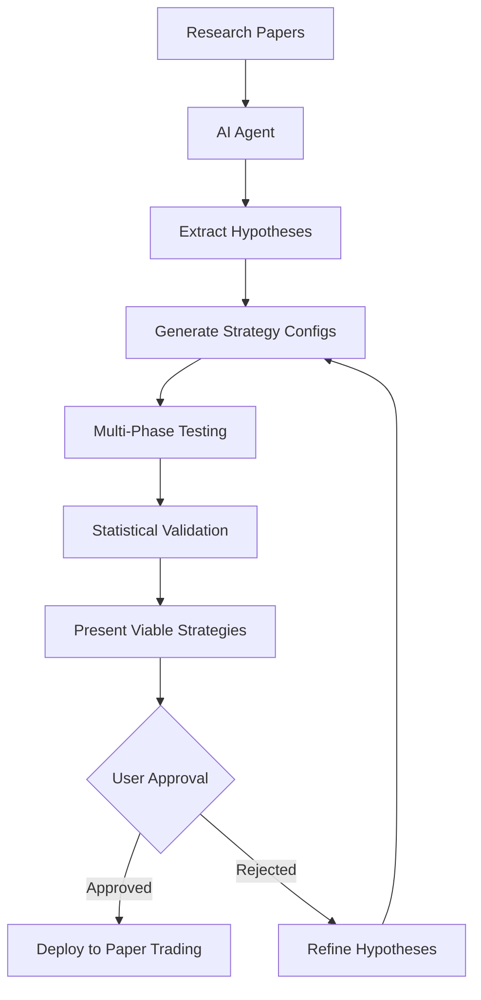

# ADMF-PC Product Vision: The Future of Quantitative Trading

## Executive Summary

ADMF-PC represents a paradigm shift in quantitative trading platforms, combining advanced architecture with accessible user experience. By leveraging protocol-based design, composable containers, and AI-powered research capabilities, we're building the first platform where retail traders can access institutional-quality strategy research through intuitive interfaces and automated analysis.

## The Market Opportunity

### Current State of Retail Trading Tools

**Existing Solutions Are Inadequate:**
- **TradingView/Pine Script**: Limited backtesting, no serious optimization
- **QuantConnect**: Requires programming, expensive for retail
- **MetaTrader**: Primitive architecture, single-asset focus
- **Python Libraries**: High technical barrier, no UI

**The Gap**: Serious traders want institutional-quality research but can't code or afford professional platforms.

### Our Solution: Professional Research, Consumer Experience

ADMF-PC bridges this gap by combining:
- **Backend**: Enterprise-grade architecture with protocol-based components
- **Frontend**: Intuitive UI that generates configurations automatically
- **AI Layer**: Automated research that works while users sleep

## Product Vision

### Core Value Proposition

**"Professional-grade strategy research with zero coding required"**

Users can:
1. **Build strategies** through intuitive forms instead of YAML/code
2. **Watch strategies trade** through interactive step-by-step visualization
3. **Sleep while AI researches** new strategies from academic papers
4. **Deploy with confidence** using rigorous multi-phase validation

### Target Market Segments

#### Primary: Serious Retail Traders ($50-200/month)
- **Profile**: $10K-$500K accounts, want systematic approaches
- **Pain Point**: Can't access institutional research tools
- **Solution**: Professional optimization with consumer-friendly interface

#### Secondary: Indie Funds ($500-2000/month)
- **Profile**: Small hedge funds, family offices, prop trading firms
- **Pain Point**: Don't want to build infrastructure teams
- **Solution**: White-label strategy research platform

#### Tertiary: Fintech Integration (Enterprise licensing)
- **Profile**: Robo-advisors, wealth management platforms
- **Pain Point**: Need differentiated strategies beyond buy-and-hold
- **Solution**: Strategy engine API for platform integration

## User Experience Revolution

### From Technical Barriers to Intuitive Building

**Current Experience (Technical):**
```yaml
strategies:
  - name: "momentum_strategy"
    type: "momentum"
    fast_period: [5, 10, 15, 20]
    slow_period: [20, 30, 40, 50]
    signal_threshold: [0.01, 0.015, 0.02]
```

**New Experience (Visual):**
```
┌─────────────────────────────────────────────────────┐
│ Strategy Builder                                    │
├─────────────────────────────────────────────────────┤
│ Strategy Type: [Momentum ▼]                        │
│                                                     │
│ Parameters to Optimize:                             │
│ ├ Fast Period:  [5] to [20] step [5]              │
│ ├ Slow Period:  [20] to [50] step [10]            │
│ └ Threshold:    [0.01] to [0.02] step [0.005]     │
│                                                     │
│ Symbols: [AAPL] [GOOGL] [+ Add Symbol]            │
│                                                     │
│ Date Range: [2020-01-01] to [2023-12-31]          │
│                                                     │
│ [Preview YAML] [Run Optimization]                  │
└─────────────────────────────────────────────────────┘
```

### Interactive Strategy Visualization

**The Killer Feature: Step-Through Backtest Playback**

```
┌──────────────────────────────────────────────────────────────────────────────┐
│ AAPL - Momentum Strategy Backtest                    Speed: [>] [>>] [|||]    │
├──────────────────────────────────────────────────────────────────────────────┤
│ 📈 Price Chart                                                               │
│                                                                              │
│ 160 ┤                                     ●BUY                               │
│ 155 ┤           ◄─ Fast MA                ↑                                  │
│ 150 ┤     ◄─ Slow MA           ╭─────────╮ │                                 │
│ 145 ┤                     ╭────╯         ╰─╯                                │
│ 140 ┤               ╭─────╯                                                  │
│ 135 ┤         ╭─────╯                                                        │
│ 130 ┤   ╭─────╯                                                              │
│     └─┬─┬─┬─┬─┬─┬─┬─┬─┬─┬─┬─┬─┬─┬─┬─┬─┬─┬─┬─┬─┬─┬─┬─┬─┬─┬─┬─┬─┬─┬─┬─┬─┬─┬─    │
│       Jan   Feb   Mar   Apr   May ◄── Current Bar: 2023-05-15               │
├──────────────────────────────────────────────────────────────────────────────┤
│ 📊 Strategy State                                                            │
│                                                                              │
│ Signal Strength: ████████░░ 0.85  │  Position: 100 shares                   │
│ Fast MA (10):    $152.34          │  Unrealized P&L: +$847                  │
│ Slow MA (30):    $148.91          │  Portfolio Value: $101,847               │
│ Crossover:       ↗ BULLISH        │  Cash: $1,847                           │
├──────────────────────────────────────────────────────────────────────────────┤
│ 📋 Event Log                                                                 │
│ 2023-05-15 09:30: Fast MA crossed above Slow MA                            │
│ 2023-05-15 09:30: Signal generated: BUY strength=0.85                      │
│ 2023-05-15 09:30: Risk check: PASSED (within limits)                       │
│ 2023-05-15 09:31: Order submitted: BUY 100 AAPL @ MARKET                   │
│ 2023-05-15 09:31: Fill received: 100 AAPL @ $152.15 (slippage: $0.04)     │
└──────────────────────────────────────────────────────────────────────────────┘
```

**Why This Matters:**
- **Educational**: Users understand exactly why strategies work/fail
- **Confidence-building**: See logic before risking real money
- **Debugging**: Spot exactly where strategies break down
- **Shareable**: Create proof of concept for social validation

## AI-Powered Research Revolution

### The Vision: Research While You Sleep

**Traditional Research Process:**
```
Read Paper → Understand Concept → Code Strategy → Test Parameters → Analyze Results
```
**Time**: Weeks per strategy, requires technical expertise

**AI-Powered Research Process:**
```
AI Reads Papers → Generates Hypotheses → Creates Experiments → Validates Results → Reports Findings
```
**Time**: Hours per strategy, zero technical expertise required

### Autonomous Research Workflow



### Example AI Research Output

**Morning Report:**
```
Good morning! While you were sleeping, I:

📚 Analyzed 12 new research papers
🧪 Generated 47 testable hypotheses  
🔬 Ran 2,847 strategy variations
✅ Found 3 robust strategies worth your attention

Top Discovery:
- Combined insights from "Volatility Risk Premium" (2024) and "Term Structure Dynamics" (2023)
- Discovered that VRP harvesting works 2.3x better when term structure is inverted
- Strategy shows 1.7 Sharpe with 0.91 stability score
- Survived all walk-forward windows and regime transitions

Also tested but rejected:
- 44 strategies that looked good in training but failed validation
- Saved you approximately 120 hours of manual research

Ready for deeper analysis? Check dashboard for details.

💡 New hypothesis to explore: Papers suggest correlation breakdown during Fed announcements might be tradeable...
```

## Technical Architecture Advantages

### Protocol + Composition Foundation

**Traditional Systems (Inheritance-based):**
```python
class MyStrategy(BaseStrategy):  # ❌ Locked into framework
    def __init__(self):
        super().__init__()  # ❌ Inherits all baggage
```

**ADMF-PC (Protocol-based):**
```python
# ✅ Mix ANY components
strategy_components = [
    SimpleMovingAverage(20),              # Your indicator
    ta.RSI(period=14),                    # TA-Lib indicator  
    sklearn.RandomForestClassifier(),     # ML model
    custom_momentum_calc,                 # Simple function
    ExternalLibrarySignal("momentum"),    # Third-party library
]
```

**Result**: Complete freedom to mix existing libraries, ML models, and custom functions.

### Container-Based Execution

**Three Composable Patterns:**

1. **Full Backtest Container**: Complete strategy evaluation
2. **Signal Replay Container**: 100x faster ensemble optimization  
3. **Signal Generation Container**: Pure research without execution

**Benefits:**
- **Complete Isolation**: No state leakage between parallel backtests
- **Reproducible Results**: Same configuration → identical execution
- **Massive Parallelization**: Run thousands of tests simultaneously
- **Safe Experimentation**: Test without affecting production systems

### Event-Driven Communication

```
Strategy → SIGNAL Event → Risk Container → ORDER Event → Execution → FILL Event
```

**Advantages:**
- **Clear Data Flow**: Unidirectional, no circular dependencies
- **Easy Testing**: Mock any component independently
- **Real-time Monitoring**: Watch events flow through system
- **Extensible**: Add components without changing existing code

## Product Roadmap

### Phase 1: Foundation (0-6 months)
**Goal**: Prove core value proposition with basic UI

**Features:**
- **Form-based strategy builder** (no YAML required)
- **Basic broker integrations** (Interactive Brokers, Alpaca)
- **Simple backtesting** with chart visualization
- **10 pre-built strategy templates**

**Target**: 50 beta users, validate product-market fit

### Phase 2: Visual Experience (6-12 months)
**Goal**: Deliver unique visualization capabilities

**Features:**
- **Step-through backtest playback** (the killer feature)
- **TradingView-style charting** with strategy overlays
- **Multi-strategy portfolio builder**
- **Community features** (share configurations, discuss results)

**Target**: 500 paying users, $50K ARR

### Phase 3: AI Research Engine (12-18 months)
**Goal**: Launch autonomous research capabilities

**Features:**
- **AI paper analysis** and hypothesis generation
- **Automated strategy testing** while users sleep
- **Morning research reports** with curated findings
- **Advanced optimization** workflows

**Target**: 1,500 users, $2M ARR, establish market leadership

### Phase 4: Platform & Ecosystem (18-24 months)
**Goal**: Build sustainable competitive moats

**Features:**
- **Strategy marketplace** (buy/sell successful configs)
- **White-label solutions** for fintech partners
- **Advanced AI capabilities** (multi-agent collaboration)
- **Enterprise features** (team collaboration, compliance)

**Target**: 5,000+ users, $5M+ ARR, platform network effects

## Competitive Positioning

### vs Existing Solutions

| Feature | ADMF-PC | QuantConnect | TradingView | Backtrader |
|---------|---------|--------------|-------------|------------|
| **No Coding Required** | ✅ | ❌ | ❌ | ❌ |
| **Visual Strategy Builder** | ✅ | ❌ | Basic | ❌ |
| **Step-through Playback** | ✅ | ❌ | ❌ | ❌ |
| **AI Research Assistant** | ✅ | ❌ | ❌ | ❌ |
| **Multi-asset Optimization** | ✅ | ✅ | ❌ | ✅ |
| **Container Isolation** | ✅ | ✅ | ❌ | ❌ |
| **Self-hosted Option** | ✅ | ❌ | ❌ | ✅ |

### Unique Value Propositions

1. **"Watch Your Strategy Trade"**: Step-through visualization no one else offers
2. **"Research While You Sleep"**: AI-powered autonomous research
3. **"Zero Code Required"**: Form-based strategy building
4. **"Professional Grade"**: Enterprise architecture for retail prices

## Business Model

### Freemium SaaS Approach

**Free Tier**: Basic backtesting to drive adoption
- 1 strategy at a time
- Basic chart visualization
- Limited historical data (1 year)
- Community access

**Pro Tier ($99/month)**: Serious individual traders
- Unlimited strategies
- Step-through playback
- Full historical data (20+ years)
- Multi-asset optimization
- Paper trading integration

**Research Tier ($199/month)**: AI-powered research
- Everything in Pro
- AI research assistant
- Automated overnight analysis
- Morning research reports
- Advanced optimization workflows

**Enterprise**: Custom pricing for institutions
- White-label options
- Team collaboration features
- Compliance and audit tools
- Priority support and custom development

### Revenue Projections

**Conservative Scenario:**
```
Year 1: 200 users × $100 avg × 12 months = $240K ARR
Year 2: 800 users × $120 avg × 12 months = $1.15M ARR
Year 3: 2,000 users × $150 avg × 12 months = $3.6M ARR
```

**Success Factors:**
- **Product-Market Fit**: Real pain point with clear solution
- **Unique Technology**: Defensible technical advantages
- **Network Effects**: Community sharing drives adoption
- **AI Timing**: Market ready for AI-assisted trading tools

## Go-to-Market Strategy

### Phase 1: Developer/Power User Adoption
**Target**: Quantitative trading enthusiasts
**Channels**: 
- Technical blogs and content marketing
- Reddit (r/algotrading, r/SecurityAnalysis)
- GitHub presence and open-source components
- Conference presentations (PyData, QuantCon)

### Phase 2: Retail Trader Expansion  
**Target**: Serious retail traders wanting systematic approaches
**Channels**:
- YouTube tutorials and strategy showcases
- Trading Discord communities
- Influencer partnerships
- Step-through visualization demos (viral potential)

### Phase 3: AI Research Marketing
**Target**: Traders interested in automation
**Channels**:
- "Research while you sleep" campaign
- AI trading content and case studies
- Fintech conference presence
- Partnership with trading educators

## Success Metrics

### Product Metrics
- **User Engagement**: Strategies built per user per month
- **Research Velocity**: Time from idea to validated strategy
- **Success Rate**: Percentage of strategies that pass validation
- **AI Effectiveness**: Strategies discovered vs human-generated

### Business Metrics
- **Monthly Recurring Revenue (MRR)**: Target $500K by end of Year 2
- **Customer Acquisition Cost (CAC)**: Target <3 months payback
- **Net Revenue Retention**: Target >110% (expansion revenue)
- **Net Promoter Score**: Target >50 (strong advocacy)

## Risk Mitigation

### Technical Risks
- **Complexity**: Start with simple forms, gradually add complexity
- **Performance**: Leverage existing optimized backend architecture
- **Reliability**: Container isolation prevents cascading failures

### Market Risks
- **Education**: Invest heavily in content and tutorials
- **Competition**: Technical moat provides 18-24 month lead time
- **Regulation**: Position as research tools, not investment advice

### Business Risks
- **Customer Acquisition**: Focus on organic growth through unique features
- **Retention**: Community features and continuous AI improvements
- **Scaling**: Architecture designed for cloud deployment

## Conclusion

ADMF-PC represents a unique opportunity to transform quantitative trading from a technical discipline into an accessible tool for serious traders. By combining enterprise-grade architecture with consumer-friendly interfaces and AI-powered research, we can capture significant market share in the growing retail trading and indie fund markets.

The key advantages - step-through visualization, AI research automation, and zero-code strategy building - create strong competitive moats while addressing real pain points in the market. With the right execution, this platform could become the standard for systematic trading research and development.

**The future of trading isn't just algorithmic - it's AI-assisted research running 24/7, presented through intuitive interfaces that make professional-grade tools accessible to anyone serious about systematic trading.**