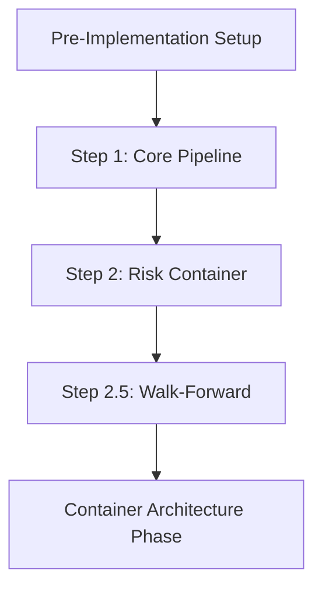

# Foundation Phase (Steps 1-2.5)

This phase establishes the core event-driven pipeline and critical data management infrastructure.

## 🎯 Phase Objectives

1. Build and validate the fundamental event-driven architecture
2. Implement proper container-based risk management
3. Establish walk-forward data splitting for optimization
4. Create a solid foundation for more complex features

## 📋 Steps in This Phase

### [Step 1: Core Pipeline Test](step-01-core-pipeline.md)
**Build the basic event flow**
- Data source → Indicator → Strategy → Risk → Execution
- Event bus isolation validation
- Simple moving average strategy
- End-to-end signal processing

### [Step 2: Add Risk Container](step-02-risk-container.md)
**Encapsulate risk management**
- Portfolio state tracking
- Position sizing logic
- Risk limit enforcement
- Order generation from signals

### [Step 2.5: Walk-Forward Foundation](step-02.5-walk-forward.md)
**Critical data splitting infrastructure**
- Train/validation/test splitting
- No look-ahead bias prevention
- Rolling window optimization
- Foundation for all future optimization

## 🔗 Phase Dependencies



## ✅ Phase Completion Criteria

Before moving to the Container Architecture phase:

### Technical Requirements
- [ ] Basic event pipeline operational
- [ ] Risk container properly encapsulated
- [ ] Walk-forward splitting working correctly
- [ ] No event bus leakage detected
- [ ] All components properly isolated

### Testing Requirements
- [ ] Unit test coverage > 90%
- [ ] Integration tests passing
- [ ] System tests with synthetic data
- [ ] Performance benchmarks met

### Documentation Requirements
- [ ] All code files have proper headers
- [ ] Architecture references included
- [ ] Logging standards followed
- [ ] Test specifications documented

## 💡 Key Concepts Introduced

1. **Event-Driven Architecture**
   - Components communicate via events
   - Loose coupling between modules
   - Asynchronous processing

2. **Container Isolation**
   - Each container has its own event bus
   - No shared state between containers
   - Lifecycle management

3. **Walk-Forward Analysis**
   - Prevents overfitting
   - Ensures out-of-sample validation
   - Realistic performance estimates

## 🐛 Common Pitfalls

1. **Skipping Event Isolation**
   - Always validate container isolation
   - Use unique container IDs
   - Clean up after tests

2. **Inadequate Risk Management**
   - Don't bypass risk limits
   - Track portfolio state accurately
   - Handle edge cases

3. **Data Leakage**
   - Never use future data in training
   - Validate split boundaries
   - Test with synthetic data first

## 📊 Performance Targets

- Event processing: < 1ms per event
- Risk calculations: < 1ms per signal
- Data splitting: < 100ms for 10 years
- Memory usage: < 100MB for basic backtest

## 🚀 Next Phase

Once all steps are complete and validated:
→ [Container Architecture Phase](../02-container-architecture/README.md)

## 📝 Phase Checklist

Use this checklist to track your progress:

```markdown
## Foundation Phase Progress

### Step 1: Core Pipeline Test
- [ ] Implementation complete
- [ ] Unit tests passing (coverage: ___%)
- [ ] Integration tests passing
- [ ] System tests passing
- [ ] Documentation complete
- [ ] Performance validated

### Step 2: Add Risk Container
- [ ] Implementation complete
- [ ] Unit tests passing (coverage: ___%)
- [ ] Integration tests passing
- [ ] System tests passing
- [ ] Documentation complete
- [ ] Performance validated

### Step 2.5: Walk-Forward Foundation
- [ ] Implementation complete
- [ ] Unit tests passing (coverage: ___%)
- [ ] Integration tests passing
- [ ] System tests passing
- [ ] Documentation complete
- [ ] Performance validated

### Phase Completion
- [ ] All steps validated
- [ ] Integration between steps tested
- [ ] Ready for Container Architecture phase
```

## 📖 Additional Resources

- [Event-Driven Architecture Guide](../../architecture/01-EVENT-DRIVEN-ARCHITECTURE.md)
- [Container Design Patterns](../../core/containers/patterns.md)
- [Testing Best Practices](../../testing-framework/best-practices.md)