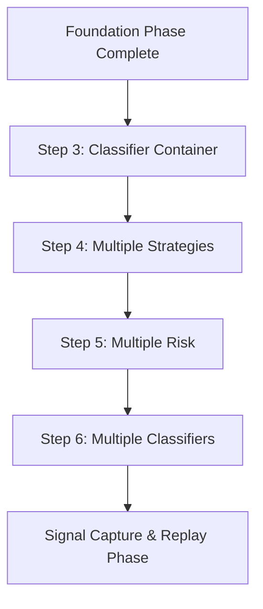

# Container Architecture Phase (Steps 3-6)

This phase implements the nested container hierarchy that enables sophisticated strategy coordination and risk management.

## 🎯 Phase Objectives

1. Implement classifier containers for market regime detection
2. Enable multiple strategies running in isolation
3. Create hierarchical risk management with multiple risk containers
4. Support multiple classifiers for ensemble regime detection
5. Demonstrate the power of Protocol + Composition architecture

## 📋 Steps in This Phase

### [Step 3: Classifier Container](step-03-classifier-container.md)
**Market regime detection and classification**
- HMM and pattern-based classifiers
- Regime change event emission
- Strategy switching based on regime
- Isolated classifier state management

### [Step 4: Multiple Strategies](step-04-multiple-strategies.md)
**Parallel strategy execution with coordination**
- Strategy isolation and lifecycle management
- Signal aggregation (weighted voting, majority)
- Performance tracking and attribution
- Dynamic weight adjustment

### [Step 5: Multiple Risk Containers](step-05-multiple-risk.md)
**Hierarchical risk management**
- Strategy-specific risk containers
- Portfolio-level risk aggregation
- Cross-strategy correlation monitoring
- Dynamic capital reallocation

### [Step 6: Multiple Classifiers](step-06-multiple-classifiers.md)
**Ensemble regime detection**
- Multiple classifier types in parallel
- Classifier consensus mechanisms
- Confidence-weighted regime detection
- A/B testing of classifiers

## 🔗 Phase Dependencies



## ✅ Phase Completion Criteria

Before moving to the Signal Capture & Replay phase:

### Technical Requirements
- [ ] Container hierarchy fully implemented
- [ ] Event isolation verified at all levels
- [ ] Strategy coordination working smoothly
- [ ] Risk aggregation accurate
- [ ] Classifier ensemble functional

### Architecture Requirements
- [ ] Protocol + Composition patterns followed
- [ ] Zero inheritance maintained
- [ ] Duck typing used appropriately
- [ ] Container lifecycle managed properly

### Testing Requirements
- [ ] Unit test coverage > 90%
- [ ] Integration tests for all interactions
- [ ] System tests with multiple containers
- [ ] Performance benchmarks met
- [ ] Memory usage within limits

## 💡 Key Concepts Introduced

### 1. Container Hierarchy
```
Portfolio Container
├── Classifier Containers
│   ├── HMM Classifier
│   └── Pattern Classifier
├── Strategy Coordinator
│   ├── Momentum Strategy Container
│   ├── Mean Reversion Container
│   └── Trend Following Container
└── Hierarchical Risk Manager
    ├── Momentum Risk Container
    ├── Mean Reversion Risk Container
    └── Trend Following Risk Container
```

### 2. Event Isolation Pattern
- Each container has its own event bus
- No direct communication between containers
- Parent containers subscribe to child events
- Strict event flow hierarchy

### 3. Resource Management
- Capital allocation to strategies
- CPU/memory resource limits
- Graceful degradation on failures
- Performance-based reallocation

## 🐛 Common Pitfalls

### 1. Event Bus Leakage
**Problem**: Events from one container affecting another
**Solution**: Always use unique container IDs and verify isolation

### 2. State Synchronization
**Problem**: Inconsistent state between containers
**Solution**: Use event-driven updates, never share state directly

### 3. Resource Starvation
**Problem**: One strategy consuming all resources
**Solution**: Implement resource quotas and monitoring

### 4. Circular Dependencies
**Problem**: Containers depending on each other circularly
**Solution**: Follow strict hierarchy, use events for communication

## 📊 Performance Targets

- Container creation: < 10ms per container
- Event routing: < 0.1ms per event
- Signal aggregation: < 5ms for 10 strategies
- Risk calculation: < 2ms per signal
- Classifier inference: < 1ms per bar
- Total system overhead: < 20ms per bar with all containers

## 🎯 Architectural Patterns

### 1. Factory Pattern for Containers
```python
def create_strategy_container(strategy_type: str, config: Dict) -> StrategyContainer:
    """Factory method for creating strategy containers"""
    strategy_map = {
        'momentum': MomentumStrategy,
        'mean_reversion': MeanReversionStrategy,
        'trend_following': TrendFollowingStrategy
    }
    return StrategyContainer(strategy_map[strategy_type], config)
```

### 2. Observer Pattern for Events
```python
class EventBus:
    def subscribe(self, event_type: str, handler: Callable):
        """Subscribe to events following observer pattern"""
        self.subscribers[event_type].append(handler)
```

### 3. Strategy Pattern for Aggregation
```python
class SignalAggregator(ABC):
    @abstractmethod
    def aggregate(self, signals: List[Signal]) -> ConsensusSignal:
        """Different aggregation strategies"""
        pass
```

## 📦 Memory Management

### Container Memory Limits
- Classifier container: 50MB max
- Strategy container: 100MB max
- Risk container: 75MB max
- Total system: 1GB max for 10 strategies

### Memory Monitoring
```python
@memory_monitor
def process_bar(container_system, bar):
    """Monitor memory usage during processing"""
    container_system.on_bar(bar)
    check_memory_limits()
```

## 🚀 Next Phase

Once all steps are complete and validated:
→ [Signal Capture & Replay Phase](../03-signal-capture-replay/README.md)

## 📝 Phase Checklist

Use this checklist to track your progress:

```markdown
## Container Architecture Phase Progress

### Step 3: Classifier Container
- [ ] Implementation complete
- [ ] Unit tests passing (coverage: ___%)
- [ ] Integration tests passing
- [ ] System tests passing
- [ ] Documentation complete
- [ ] Performance validated

### Step 4: Multiple Strategies
- [ ] Implementation complete
- [ ] Unit tests passing (coverage: ___%)
- [ ] Integration tests passing
- [ ] System tests passing
- [ ] Documentation complete
- [ ] Performance validated

### Step 5: Multiple Risk Containers
- [ ] Implementation complete
- [ ] Unit tests passing (coverage: ___%)
- [ ] Integration tests passing
- [ ] System tests passing
- [ ] Documentation complete
- [ ] Performance validated

### Step 6: Multiple Classifiers
- [ ] Implementation complete
- [ ] Unit tests passing (coverage: ___%)
- [ ] Integration tests passing
- [ ] System tests passing
- [ ] Documentation complete
- [ ] Performance validated

### Phase Completion
- [ ] All steps validated
- [ ] Container hierarchy tested end-to-end
- [ ] Performance benchmarks met
- [ ] Ready for Signal Capture phase
```

## 📖 Additional Resources

- [Container Design Patterns](../../core/containers/patterns.md)
- [Protocol + Composition Benefits](../../PC/BENEFITS.md)
- [Event-Driven Architecture](../../architecture/01-EVENT-DRIVEN-ARCHITECTURE.md)
- [Risk Management Best Practices](../../risk/best-practices.md)