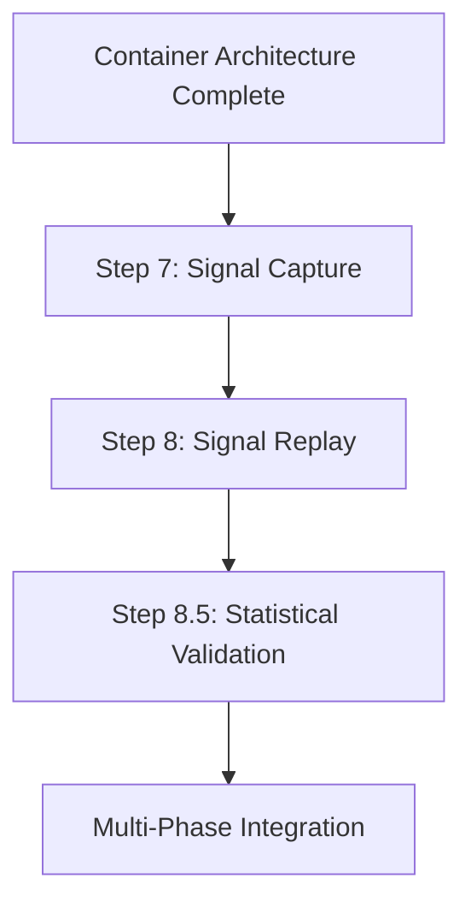

# Signal Capture & Replay Phase (Steps 7-8.5)

This phase implements the signal capture and replay infrastructure that enables fast optimization and backtesting iteration.

## 🎯 Phase Objectives

1. Capture all signals and events during backtesting
2. Enable replay of captured signals for fast parameter optimization
3. Implement statistical validation through Monte Carlo and Bootstrap methods
4. Dramatically reduce optimization time by avoiding strategy recalculation
5. Support what-if analysis on different risk parameters

## 📋 Steps in This Phase

### [Step 7: Signal Capture](step-07-signal-capture.md)
**Comprehensive event logging**
- Capture all strategy signals with metadata
- Store indicator values at signal time
- Record market conditions
- Implement efficient storage format
- Enable signal analysis and debugging

### [Step 8: Signal Replay](step-08-signal-replay.md)
**Fast optimization through replay**
- Replay captured signals with different parameters
- Skip strategy calculation phase
- Test different risk settings instantly
- Support parameter sensitivity analysis
- Enable rapid iteration

### [Step 8.5: Statistical Validation](step-08.5-monte-carlo.md)
**Monte Carlo and Bootstrap methods**
- Monte Carlo simulation for robustness
- Bootstrap for confidence intervals
- Statistical significance testing
- Performance distribution analysis
- Overfitting detection

## 🔗 Phase Dependencies



## ✅ Phase Completion Criteria

Before moving to Multi-Phase Integration:

### Technical Requirements
- [ ] Signal capture system operational
- [ ] All relevant event data preserved
- [ ] Replay system accurately reproduces results
- [ ] Statistical validation framework functional
- [ ] Performance improvements verified

### Performance Requirements
- [ ] Signal capture overhead < 5% of runtime
- [ ] Replay 10x faster than full backtest
- [ ] Storage efficient (< 1MB per 1000 signals)
- [ ] Statistical tests complete in reasonable time

### Testing Requirements
- [ ] Capture/replay produces identical results
- [ ] Statistical tests validate robustness
- [ ] Edge cases handled properly
- [ ] Memory usage within bounds

## 💡 Key Concepts Introduced

### 1. Signal Capture Architecture
```python
class SignalCapture:
    """Captures all signals and relevant context"""
    def capture_signal(self, signal: Signal, context: Context):
        self.storage.append({
            'signal': signal,
            'timestamp': context.timestamp,
            'market_state': context.market_state,
            'indicators': context.indicators,
            'portfolio_state': context.portfolio_state
        })
```

### 2. Replay Pattern
```python
class SignalReplayEngine:
    """Replays captured signals with new parameters"""
    def replay(self, captured_signals: List[CapturedSignal], 
               new_params: Dict) -> BacktestResults:
        # Skip strategy calculation
        # Apply new risk parameters
        # Generate results 10x faster
```

### 3. Statistical Validation
```python
class MonteCarloValidator:
    """Validates strategy robustness"""
    def validate(self, results: BacktestResults) -> ValidationReport:
        # Generate random variations
        # Test stability
        # Calculate confidence intervals
```

## 🐛 Common Pitfalls

### 1. Incomplete Capture
**Problem**: Missing critical context during capture
**Solution**: Capture comprehensive state at signal time

### 2. Replay Drift
**Problem**: Replay results differ from original
**Solution**: Validate exact reproduction before optimization

### 3. Storage Explosion
**Problem**: Captured data grows too large
**Solution**: Implement efficient storage and compression

### 4. Statistical Misinterpretation
**Problem**: Over-interpreting validation results
**Solution**: Understand limitations of statistical tests

## 📊 Performance Benefits

### Traditional Optimization
- 1000 parameter combinations × 5 min/backtest = 83 hours

### With Signal Replay
- Initial capture: 5 minutes
- 1000 replays × 30 sec/replay = 8.3 hours
- **10x speedup!**

### Optimization Workflow
```
1. Run full backtest with signal capture (once)
2. Replay with different parameters (many times)
3. Find optimal parameters quickly
4. Validate with full backtest (once)
```

## 🎯 Best Practices

### 1. Capture Design
- Capture at the right granularity
- Balance completeness vs storage
- Include all decision factors
- Version captured data format

### 2. Replay Accuracy
- Always validate replay accuracy
- Test with known scenarios
- Monitor for drift over time
- Document any approximations

### 3. Statistical Rigor
- Use appropriate sample sizes
- Understand test assumptions
- Report confidence intervals
- Avoid p-hacking

## 📦 Storage Considerations

### Signal Storage Format
```python
@dataclass
class CapturedSignal:
    # Core signal data
    signal_id: str
    timestamp: datetime
    symbol: str
    direction: Direction
    strength: float
    
    # Context data
    market_price: float
    spread: float
    volume: int
    
    # Indicator snapshot
    indicators: Dict[str, float]
    
    # Portfolio snapshot
    position: float
    capital: float
    
    # Metadata
    strategy_id: str
    strategy_params: Dict
```

### Storage Optimization
- Use binary formats (HDF5, Parquet)
- Compress repeated data
- Index by timestamp
- Partition by date/symbol

## 🚀 Next Phase

Once all steps are complete and validated:
→ [Multi-Phase Integration](../04-multi-phase-integration/README.md)

## 📝 Phase Checklist

Use this checklist to track your progress:

```markdown
## Signal Capture & Replay Phase Progress

### Step 7: Signal Capture
- [ ] Implementation complete
- [ ] Unit tests passing (coverage: ___%)
- [ ] Integration tests passing
- [ ] System tests passing
- [ ] Documentation complete
- [ ] Performance validated

### Step 8: Signal Replay
- [ ] Implementation complete
- [ ] Unit tests passing (coverage: ___%)
- [ ] Integration tests passing
- [ ] System tests passing
- [ ] Documentation complete
- [ ] Performance validated

### Step 8.5: Statistical Validation
- [ ] Implementation complete
- [ ] Unit tests passing (coverage: ___%)
- [ ] Integration tests passing
- [ ] System tests passing
- [ ] Documentation complete
- [ ] Performance validated

### Phase Completion
- [ ] All steps validated
- [ ] Capture/replay accuracy verified
- [ ] Statistical framework operational
- [ ] Performance gains confirmed
- [ ] Ready for Multi-Phase Integration
```

## 📖 Additional Resources

- [Event Sourcing Patterns](../../patterns/event-sourcing.md)
- [Statistical Testing in Finance](../references/statistical-testing.md)
- [Performance Optimization Guide](../optimization/performance-guide.md)
- [Storage Best Practices](../references/storage-patterns.md)