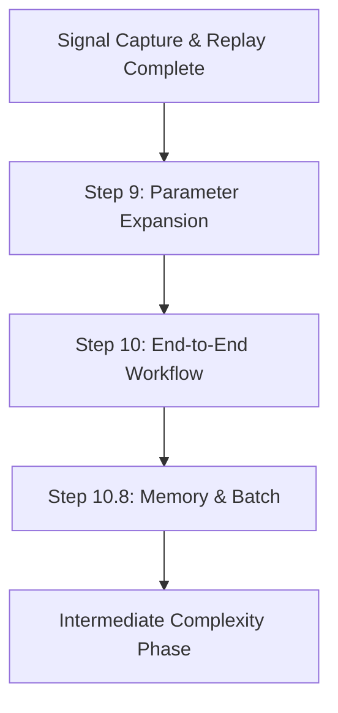

# Multi-Phase Integration Phase (Steps 9-10.8)

This phase implements the complete multi-phase optimization workflow, orchestrating complex parameter searches and enabling batch processing at scale.

## 🎯 Phase Objectives

1. Expand parameter search space systematically
2. Integrate all components into end-to-end workflows
3. Coordinate multiple optimization phases
4. Enable memory-efficient batch processing
5. Support parallel execution of thousands of configurations

## 📋 Steps in This Phase

### [Step 9: Parameter Expansion](step-09-parameter-expansion.md)
**Systematic parameter space exploration**
- Grid search implementation
- Random search optimization
- Bayesian optimization integration
- Parameter importance analysis
- Constraint handling

### [Step 10: End-to-End Workflow](step-10-end-to-end-workflow.md)
**Complete integrated optimization workflow**
- Multi-phase coordinator
- Workflow orchestration
- State persistence between phases
- Result aggregation
- Progress tracking and resumption

### [Step 10.8: Memory & Batch Processing](step-10.8-memory-batch.md)
**Scale to thousands of configurations**
- Memory monitoring and management
- Batch processing infrastructure
- Parallel execution framework
- Resource allocation
- Distributed computing support

## 🔗 Phase Dependencies



## ✅ Phase Completion Criteria

Before moving to Intermediate Complexity:

### Technical Requirements
- [ ] Parameter expansion methods implemented
- [ ] Multi-phase workflow operational
- [ ] Batch processing infrastructure ready
- [ ] Memory management effective
- [ ] Parallel execution working

### Performance Requirements
- [ ] Handle 1000+ parameter combinations
- [ ] Process configurations in parallel
- [ ] Memory usage stays within bounds
- [ ] Checkpoint/resume functionality
- [ ] Results aggregation efficient

### Integration Requirements
- [ ] All phases coordinate smoothly
- [ ] State preserved between phases
- [ ] Results properly aggregated
- [ ] Progress tracking accurate
- [ ] Error recovery functional

## 💡 Key Concepts Introduced

### 1. Multi-Phase Coordinator
```python
class MultiPhaseCoordinator:
    """Orchestrates complex optimization workflows"""
    def run_workflow(self, workflow_config: WorkflowConfig):
        for phase in workflow_config.phases:
            results = self.run_phase(phase)
            self.persist_results(phase.name, results)
            if not self.should_continue(results):
                break
```

### 2. Parameter Expansion
```python
class ParameterExpander:
    """Systematic parameter space exploration"""
    def expand_parameters(self, base_params: Dict, 
                         expansion_rules: Dict) -> List[Dict]:
        # Generate all combinations
        # Apply constraints
        # Return viable parameter sets
```

### 3. Batch Processing
```python
class BatchProcessor:
    """Process configurations in batches"""
    def process_batch(self, configurations: List[Config], 
                     batch_size: int = 100):
        for batch in chunks(configurations, batch_size):
            with MemoryManager() as mm:
                results = parallel_process(batch)
                self.save_results(results)
                mm.cleanup()
```

## 🐛 Common Pitfalls

### 1. Parameter Explosion
**Problem**: Combinatorial explosion of parameters
**Solution**: Use smart search methods and constraints

### 2. Memory Exhaustion
**Problem**: Running out of memory with large batches
**Solution**: Implement proper batch sizing and cleanup

### 3. Lost Progress
**Problem**: Failures lose hours of computation
**Solution**: Checkpoint frequently and support resumption

### 4. Result Overload
**Problem**: Too many results to analyze effectively
**Solution**: Implement result filtering and aggregation

## 📊 Scalability Targets

### Single Machine
- 1,000 configurations: < 1 hour
- 10,000 configurations: < 8 hours
- Memory usage: < 16GB
- CPU utilization: > 80%

### Distributed
- 100,000 configurations: < 4 hours
- Linear scaling with workers
- Fault tolerance built-in
- Automatic load balancing

## 🎯 Workflow Patterns

### 1. Sequential Phases
```
Phase 1: Coarse Search
    ↓
Phase 2: Fine-tune Best
    ↓
Phase 3: Validate Final
```

### 2. Parallel Exploration
```
Strategy A ─┐
            ├─ Aggregate ─ Select Best
Strategy B ─┘
```

### 3. Adaptive Workflow
```
Initial Search → Analyze → Adjust Grid → Refine
        ↑                                    ↓
        └───────── Repeat if needed ───────┘
```

## 📦 Resource Management

### Memory Budgeting
```python
class MemoryBudget:
    def __init__(self, total_memory_gb: float):
        self.total = total_memory_gb * 1024 * 1024 * 1024
        self.allocated = 0
        
    def allocate(self, size_bytes: int) -> bool:
        if self.allocated + size_bytes <= self.total:
            self.allocated += size_bytes
            return True
        return False
```

### CPU Allocation
- Reserve cores for system
- Balance parallel workers
- Monitor CPU temperature
- Throttle if needed

### Disk I/O
- Buffer writes
- Compress results
- Clean temporary files
- Monitor disk space

## 🚀 Next Phase

Once all steps are complete and validated:
→ [Intermediate Complexity Phase](../05-intermediate-complexity/README.md)

## 📝 Phase Checklist

Use this checklist to track your progress:

```markdown
## Multi-Phase Integration Progress

### Step 9: Parameter Expansion
- [ ] Implementation complete
- [ ] Unit tests passing (coverage: ___%)
- [ ] Integration tests passing
- [ ] System tests passing
- [ ] Documentation complete
- [ ] Performance validated

### Step 10: End-to-End Workflow
- [ ] Implementation complete
- [ ] Unit tests passing (coverage: ___%)
- [ ] Integration tests passing
- [ ] System tests passing
- [ ] Documentation complete
- [ ] Performance validated

### Step 10.8: Memory & Batch Processing
- [ ] Implementation complete
- [ ] Unit tests passing (coverage: ___%)
- [ ] Integration tests passing
- [ ] System tests passing
- [ ] Documentation complete
- [ ] Performance validated

### Phase Completion
- [ ] All steps validated
- [ ] Integration tested end-to-end
- [ ] Performance targets met
- [ ] Ready for production scale
```

## 📖 Additional Resources

- [Optimization Theory](../references/optimization-theory.md)
- [Distributed Computing Patterns](../references/distributed-patterns.md)
- [Memory Management Best Practices](../references/memory-management.md)
- [Workflow Orchestration](../../legacy/WORKFLOW_COMPOSITION.MD)