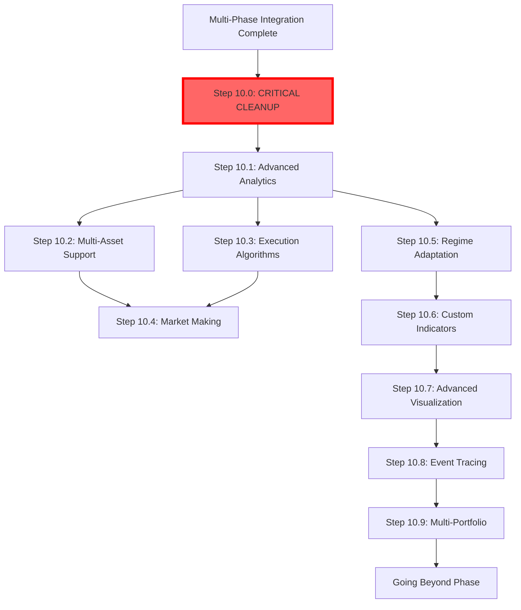

# Intermediate Complexity Phase (Steps 10.1-10.7)

This phase bridges core functionality with advanced features, introducing sophisticated analytics, multi-asset support, and advanced execution capabilities.

## 🎯 Phase Objectives

1. Implement advanced market analytics and pattern recognition
2. Enable multi-asset and portfolio-level strategies
3. Add sophisticated execution algorithms
4. Introduce market-making capabilities
5. Build regime-aware adaptive systems
6. Develop custom indicator frameworks
7. Create advanced visualization tools

## 📋 Steps in This Phase

### 🚨 [Step 10.0: Critical Codebase Cleanup](step-10.0-codebase-cleanup.md)
**MANDATORY FIRST STEP - Complete before any other work**
- Remove ~50+ duplicate implementations
- Eliminate ALL inheritance-based designs  
- Consolidate to ONE implementation per concept
- Migrate 26 files from old container system
- Fix 5 competing type systems
- Estimated time: 6 weeks

### [Step 10.1: Advanced Analytics](step-10.1-advanced-analytics.md)
**Market microstructure and pattern analysis**
- Market microstructure metrics (PIN, VPIN, Kyle's λ)
- Regime detection (HMM, change points, clustering)
- Pattern recognition and clustering
- Automated feature engineering
- Multi-factor attribution analysis

### [Step 10.2: Multi-Asset Support](step-10.2-multi-asset.md)
**Portfolio-level strategy implementation**
- Cross-asset correlation analysis
- Portfolio optimization (Mean-Variance, Black-Litterman)
- Risk parity allocation
- Dynamic rebalancing
- Currency and sector exposure management

### [Step 10.3: Execution Algorithms](step-10.3-execution-algos.md)
**Smart order routing and execution**
- TWAP/VWAP algorithms
- Implementation shortfall minimization
- Iceberg and hidden orders
- Dark pool integration
- Adaptive execution based on market conditions

### [Step 10.4: Market Making](step-10.4-market-making.md)
**Automated market making strategies**
- Bid-ask spread optimization
- Inventory risk management
- Quote adjustment algorithms
- Adverse selection mitigation
- Multi-level order book strategies

### [Step 10.5: Regime Adaptation](step-10.5-regime-adaptation.md)
**Dynamic strategy adjustment**
- Regime-specific parameter sets
- Strategy switching logic
- Performance decay detection
- Adaptive position sizing
- Risk adjustment by regime

### [Step 10.6: Custom Indicators](step-10.6-custom-indicators.md)
**Extensible indicator framework**
- Indicator plugin architecture
- Performance-optimized calculations
- Real-time indicator updates
- Indicator combination logic
- Machine learning-based indicators

### [Step 10.7: Advanced Visualization](step-10.7-visualization.md)
**Professional-grade visualization tools**
- Real-time dashboard components
- Interactive strategy analysis
- 3D risk surface visualization
- Performance attribution charts
- Custom reporting framework

### [Step 10.8: Event Tracing & Data Mining](step-10.8-event-tracing-data-mining.md)
**Comprehensive event tracking and pattern discovery**
- Complete event lineage (signal → order → fill)
- Pattern discovery and validation
- Performance attribution analysis
- Smart event sampling and compression
- SQL analytics integration

### [Step 10.9: Multi-Portfolio Architecture](step-10.9-multi-portfolio-architecture.md)
**Support for multiple isolated portfolios**
- Portfolio namespace isolation
- Cross-portfolio analytics
- Correlation monitoring
- Consolidated reporting
- Linear performance scaling

## 🔗 Phase Dependencies



## ✅ Phase Completion Criteria

Before moving to Going Beyond:

### Technical Requirements
- [ ] **Codebase cleanup complete (Step 10.0)**
  - [ ] Zero inheritance implementations
  - [ ] One canonical implementation per concept
  - [ ] All 26 files migrated from old container system
  - [ ] Single unified type system
- [ ] Advanced analytics operational
- [ ] Multi-asset strategies working
- [ ] Execution algorithms tested
- [ ] Market making profitable
- [ ] Regime adaptation effective
- [ ] Custom indicators integrated
- [ ] Visualization tools complete

### Performance Requirements
- [ ] Analytics latency < 100ms
- [ ] Support 50+ simultaneous assets
- [ ] Execution slippage minimized
- [ ] Market making spread optimized
- [ ] Regime detection accuracy > 85%
- [ ] Indicator calculations efficient
- [ ] Visualizations render smoothly

### Integration Requirements
- [ ] All components work together
- [ ] Data flows smoothly between modules
- [ ] Error handling comprehensive
- [ ] Performance monitoring active
- [ ] System stability proven

## 💡 Key Concepts Introduced

### 1. Market Microstructure
```python
class MicrostructureAnalyzer:
    """Deep market analysis beyond price/volume"""
    def analyze(self, order_book, trades):
        return {
            'spread_components': self.decompose_spread(order_book),
            'information_content': self.calculate_pin(trades),
            'execution_quality': self.assess_fills(trades)
        }
```

### 2. Portfolio Optimization
```python
class PortfolioOptimizer:
    """Multi-asset portfolio construction"""
    def optimize(self, assets, constraints):
        weights = self.mean_variance_optimize(assets)
        weights = self.apply_constraints(weights, constraints)
        return self.risk_parity_adjust(weights)
```

### 3. Smart Execution
```python
class ExecutionAlgorithm:
    """Intelligent order execution"""
    def execute(self, order, market_state):
        schedule = self.create_execution_schedule(order)
        slices = self.slice_order(order, schedule)
        return self.route_slices(slices, market_state)
```

### 4. Regime Awareness
```python
class RegimeAdaptiveStrategy:
    """Strategy that adapts to market regimes"""
    def trade(self, market_data):
        regime = self.detect_regime(market_data)
        params = self.get_regime_params(regime)
        return self.execute_with_params(params)
```

## 🐛 Common Challenges

### 1. Computational Complexity
**Problem**: Advanced analytics are computationally expensive
**Solution**: Implement caching, approximations, and parallel processing

### 2. Multi-Asset Synchronization
**Problem**: Different assets have different data frequencies
**Solution**: Implement proper time alignment and resampling

### 3. Execution Complexity
**Problem**: Real markets have complex microstructure
**Solution**: Build robust simulation and handle edge cases

### 4. Regime Stability
**Problem**: Regime detection can be noisy
**Solution**: Implement smoothing and minimum duration requirements

### 5. Visualization Performance
**Problem**: Real-time updates can be resource-intensive
**Solution**: Use efficient rendering and data decimation

## 📊 Performance Targets

### Analytics Performance
- Microstructure analysis: < 50ms per asset
- Regime detection: < 100ms update
- Pattern recognition: < 200ms per scan
- Feature generation: < 30ms per feature set

### Execution Performance
- Order slicing: < 10ms
- Route determination: < 5ms
- Fill analysis: < 20ms
- Impact estimation: < 50ms

### System Performance
- Memory usage: < 4GB for 50 assets
- CPU utilization: < 60% average
- Network latency: < 10ms to exchanges
- Database queries: < 50ms p99

## 🎯 Integration Patterns

### 1. Analytics Pipeline
```
Market Data → Microstructure → Regime Detection → Feature Generation → Signal
```

### 2. Execution Flow
```
Signal → Risk Check → Order Generation → Smart Routing → Execution → Analysis
```

### 3. Portfolio Management
```
Asset Signals → Correlation → Optimization → Allocation → Rebalancing
```

### 4. Adaptation Cycle
```
Performance Monitoring → Regime Detection → Parameter Update → Strategy Adjust
```

## 📦 Module Architecture

### Core Analytics Module
- Microstructure analyzer
- Regime detector
- Pattern recognizer
- Feature engineer
- Factor analyzer

### Execution Module
- Algorithm library
- Order slicer
- Smart router
- Fill analyzer
- Impact model

### Portfolio Module
- Optimizer
- Risk calculator
- Rebalancer
- Exposure manager
- Performance tracker

### Visualization Module
- Dashboard framework
- Chart library
- Report generator
- Alert system
- Export tools

## 🚀 Next Phase

Once all steps are complete and validated:
→ [Going Beyond Phase](../06-going-beyond/README.md)

## 📝 Phase Checklist

Use this checklist to track your progress:

```markdown
## Intermediate Complexity Progress

### Step 10.0: Critical Codebase Cleanup (MANDATORY FIRST)
- [ ] Type system consolidated (5 → 1)
- [ ] Container system migrated (26 files)
- [ ] All inheritance removed
- [ ] Duplicate implementations deleted (~50 files)
- [ ] Adjective prefixes removed from filenames
- [ ] All tests passing after cleanup

### Step 10.1: Advanced Analytics
- [ ] Microstructure analysis implemented
- [ ] Regime detection working
- [ ] Pattern recognition operational
- [ ] Feature engineering automated
- [ ] Factor attribution complete
- [ ] Performance validated

### Step 10.2: Multi-Asset Support
- [ ] Portfolio optimization implemented
- [ ] Correlation analysis working
- [ ] Risk parity functional
- [ ] Rebalancing automated
- [ ] Currency handling complete
- [ ] Performance validated

### Step 10.3: Execution Algorithms
- [ ] TWAP/VWAP implemented
- [ ] Smart routing working
- [ ] Slippage minimized
- [ ] Dark pools integrated
- [ ] Adaptive execution tested
- [ ] Performance validated

### Step 10.4: Market Making
- [ ] Spread optimization working
- [ ] Inventory management functional
- [ ] Quote adjustment automated
- [ ] Risk controls active
- [ ] Profitability tested
- [ ] Performance validated

### Step 10.5: Regime Adaptation
- [ ] Regime detection integrated
- [ ] Parameter switching working
- [ ] Performance monitoring active
- [ ] Risk adjustment functional
- [ ] Strategy selection automated
- [ ] Performance validated

### Step 10.6: Custom Indicators
- [ ] Plugin architecture complete
- [ ] Indicator library built
- [ ] Real-time updates working
- [ ] ML indicators integrated
- [ ] Performance optimized
- [ ] Documentation complete

### Step 10.7: Advanced Visualization
- [ ] Dashboard framework built
- [ ] Interactive charts working
- [ ] 3D visualizations functional
- [ ] Reports generating
- [ ] Export features complete
- [ ] Performance validated

### Step 10.8: Event Tracing & Data Mining
- [ ] TracedEvent structure implemented
- [ ] Event store with Parquet backend
- [ ] Event lineage tracking working
- [ ] Pattern discovery operational
- [ ] SQL analytics integrated
- [ ] Performance overhead < 5%

### Step 10.9: Multi-Portfolio Architecture
- [ ] Portfolio isolation complete
- [ ] Multiple portfolios running
- [ ] Cross-portfolio analytics working
- [ ] Consolidated reporting functional
- [ ] Linear performance scaling achieved
- [ ] No event leakage between portfolios

### Phase Completion
- [ ] All steps validated
- [ ] Integration tested end-to-end
- [ ] Performance targets met
- [ ] Documentation complete
- [ ] Ready for Going Beyond
```

## 📖 Additional Resources

- [Advanced Trading Strategies](../references/advanced-strategies.md)
- [Market Microstructure Handbook](../references/microstructure-handbook.md)
- [Portfolio Theory Advanced](../references/portfolio-theory-advanced.md)
- [Execution Best Practices](../references/execution-best-practices.md)