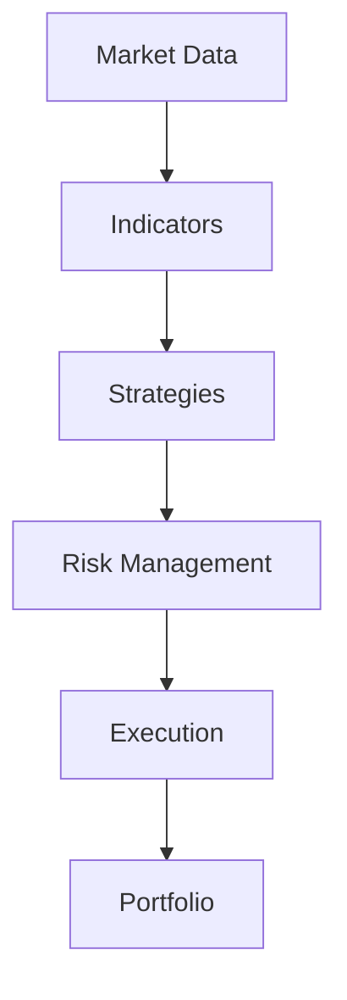

# Visual Documentation

This directory contains visual diagrams and illustrations to help understand ADMF-PC's architecture and concepts.

## 📊 Available Diagrams

### System Architecture
- **[System Overview](system-overview.md)** - High-level architecture diagram
- **[Component Relationships](component-relationships.md)** - How components interact
- **[Data Flow](data-flow.md)** - End-to-end data transformation

### Container Architecture  
- **[Container Hierarchies](container-hierarchies.md)** - Different organizational patterns
- **[Isolation Model](isolation-model.md)** - How containers achieve isolation
- **[Resource Management](resource-management.md)** - Memory and CPU allocation

### Event System
- **[Event Flows](event-flows.md)** - Event routing and transformation
- **[Communication Patterns](communication-patterns.md)** - Pipeline, broadcast, hierarchical patterns
- **[Event Lifecycle](event-lifecycle.md)** - From creation to processing

### Workflow Orchestration
- **[Workflow Patterns](workflow-patterns.md)** - Common workflow compositions
- **[Coordinator Architecture](coordinator-architecture.md)** - Central orchestration
- **[Phase Management](phase-management.md)** - Multi-phase workflow execution

### Execution Models
- **[Execution Modes](execution-modes.md)** - Full backtest vs signal replay vs generation
- **[Performance Comparisons](performance-comparisons.md)** - Speed and resource usage
- **[Scaling Patterns](scaling-patterns.md)** - Horizontal and vertical scaling

## 🎨 Diagram Types

### ASCII Diagrams
Text-based diagrams that work well in documentation:
```
Container A          Container B          Container C
┌─────────────┐     ┌─────────────┐     ┌─────────────┐
│ Event Bus   │────▶│ Event Bus   │────▶│ Event Bus   │
│ Strategy    │     │ Risk Mgmt   │     │ Execution   │
└─────────────┘     └─────────────┘     └─────────────┘
```

### Mermaid Diagrams
More sophisticated diagrams using Mermaid syntax:


### Conceptual Illustrations
High-level conceptual diagrams showing architectural principles.

## 🗺️ Navigation by Topic

### New to ADMF-PC?
Start with these visual explanations:
1. [System Overview](system-overview.md) - See the big picture
2. [Data Flow](data-flow.md) - Understand the pipeline
3. [Container Hierarchies](container-hierarchies.md) - Learn organization patterns

### Understanding Architecture?
Dive into technical diagrams:
1. [Isolation Model](isolation-model.md) - How isolation works
2. [Event Flows](event-flows.md) - Communication mechanisms
3. [Coordinator Architecture](coordinator-architecture.md) - Central orchestration

### Building Workflows?
Explore workflow patterns:
1. [Workflow Patterns](workflow-patterns.md) - Common compositions
2. [Phase Management](phase-management.md) - Multi-phase execution
3. [Execution Modes](execution-modes.md) - Performance optimization

### Optimizing Performance?
Analyze performance characteristics:
1. [Performance Comparisons](performance-comparisons.md) - Speed benchmarks
2. [Scaling Patterns](scaling-patterns.md) - Scaling strategies
3. [Resource Management](resource-management.md) - Resource optimization

## 🔧 Creating Diagrams

### Tools Used
- **ASCII Art**: For simple, text-based diagrams
- **Mermaid**: For flowcharts, sequence diagrams, and graphs
- **PlantUML**: For UML diagrams when needed
- **Custom Illustrations**: Hand-crafted diagrams for complex concepts

### Diagram Standards
1. **Consistent Styling**: Use consistent colors, fonts, and layouts
2. **Clear Labels**: All components and connections clearly labeled
3. **Progressive Complexity**: Start simple, add detail as needed
4. **Linked Examples**: Connect diagrams to working examples

### Contributing Diagrams
When adding new diagrams:
1. Follow existing style conventions
2. Include both source and rendered versions
3. Add clear explanations and captions
4. Link from relevant documentation sections

## 📱 Interactive Elements

Some diagrams include interactive elements:
- **Clickable Components**: Click to jump to detailed documentation
- **Expandable Sections**: Show/hide detail levels
- **Animation**: Show process flows over time
- **Configuration Examples**: Link to working YAML configurations

## 🎯 Diagram Categories

### **Architecture Diagrams**
Show structural relationships and dependencies

### **Flow Diagrams** 
Illustrate processes and data flow over time

### **State Diagrams**
Show how system state changes during execution

### **Deployment Diagrams**
Illustrate how components are deployed and scaled

### **Sequence Diagrams**
Show interactions between components over time

---

**Quick Start**: Begin with [System Overview](system-overview.md) for the big picture view of ADMF-PC architecture.